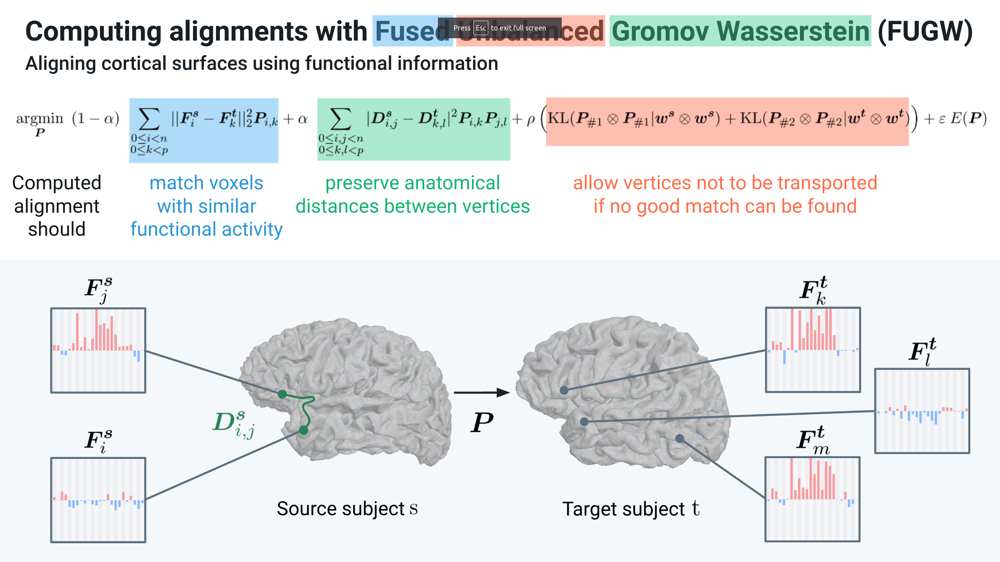

# Fused unbalanced Gromov-Wasserstein for Python

This package implements multiple GPU-compatible PyTorch solvers
to the Fused Unbalanced Gromov-Wasserstein optimization problem.

**This package is under active development. There is no guarantee that the API and solvers
won't change in the near future.**

## Introduction

### Optimization problem

In short, this code computes a matrix $P$ that matches points of two distributions $s$ and $t$.
$P$ is referred to as the _transport plan_.

We denote as $n$ and $m$ the number of points (we will also call them vertices or voxels)
of $s$ and $t$ respectively.

Two points $i$ and $j$, from $s$ and $t$ respectively, are matched based on similarity
between their respective features $F_i^s$ and $F_j^t$ (Wasserstein loss).
We fuse this loss with one that tries to preserve the respective underlying geometries of these two
distributions. We represent these geometries as kernel matrices $D^s$ and $D^t$ in the figure below.
In essence, two points which were distant from one another in the first distribution
should be matched to points which are distant from one another
in the second distribution (Gromov-Wasserstein loss).
Finally, the unbalancing part of this problem allows to leave points of the first and/or
the second distribution for which no good match can be found.

Details about the implementation and motivations are available in the original
[NeurIPS 2022 paper presenting this work](https://arxiv.org/abs/2206.09398) [(Thual, Tran et al. 2022) [1]](#1),
in which we align cortical structures of human individuals using this method.
In this case, we match areas of the cortex based on similarity of their functional activity
(ie how they behave throughout a series of experiments) while trying to preserve the anatomy of the cortex.



### Solvers

Wasserstein (W) problems are convex. This class of problems is well understood,
and a multitude of solvers exist to compute or approximate good solutions.
For instance, Sinkhorn solvers, which were first applied to W problems
in [(Cuturi 2013) [2]](#2), have proved to be very efficient.

Unfortunately, Gromov-Wasserstein (GW) problems are non-convex, consequently FUGW problems are non-convex too.
To circumvent this issue, authors in [(Séjourné et al. 2021) [3]](#3) derive a lower-bound of GW
by reformulating it as a bi-convex problem.
In short, instead of looking for a transport plan $P$ minimizing GW losses such as
$\sum_{i,j,k,l} |D^s_{i,j} - D^t_{k,l}| P_{i,k} P_{j,l}$,
one can look for 2 transport plans $P$ and $Q$ minimizing
$\sum_{i,j,k,l} |D^s_{i,j} - D^t_{k,l}| P_{i,k} Q_{j,l}$.
Note that if one imposes that $P=Q$, the two problems are equivalent.
In their paper, authors relax this constraint and only impose that
the mass of each plan is equal (ie $\text{m}(P) = \text{m}(Q)$) and the problem is now
convex in $P$ and in $Q$. Finally, they derive a block-coordinate-descent
(BCD) algorithm in which they alternatively freeze the value of $P$ (resp. $Q$)
while running a convex-problem solver (in their case it's a sinkhorn algorithm)
to optimize $Q$ (resp. $P$).

In this work, we adapt the previous approach to approximate solutions
to FUGW losses. Moreover, we provide multiple solvers to run inside the BCD algorithm.
Namely, we provide:

* `sinkhorn`: the classical Sinkhorn procedure described in [(Cuturi 2013) [2]](#2)
* `mm`: a majorize-minimization algorithm described in [(Chapel et al. 2021) [4]](#4)
* `dc`: a proximal-point approach described in [(Xie et al. 2020) [5]](#5)

## API references

This repo contains 2 main classes, `fugw.FUGW` and `fugw.FUGWSparse`.
As a rule of thumb, they are respectively suited for problems with less or more than 10k.
Each of these classes implement `.fit()`, `.transform()`
and `inverse_transform()` methods.
`fugw.FUGW` comes with implements for `"sinkhorn"`, `"mm"` and `"dc"`.
`fugw.FUGWSparse` only implements `"mm"` and `"dc"`, because `logsumexp` is not stable
in this setup.

### Class `fugw.FUGW` parameters, **for 10k points or less**

In short, this class is suited to compute transport plans between distributions
with 10k points or less.
The size of the transport plan grows quadratically with the size of the
source and target distributions:
in particular, if the source and target distributions have 10k points each,
the transport plan will be a dense tensor with `1e8` and ~500Mo.
While solving a FUGW problem, we store several matrices with such a size
(about 10, among which $P$, $Q$, $D^s$, $D^t$, $(D^s)^2$, $(D^t)^2$ and a cost matrix),
which should help you assess the maximum number of source and target points
you can use to fit such model.

* `alpha`: value in ]0, 1[, controls the relative importance of the Wasserstein and the Gromov-Wasserstein losses in the FUGW loss (see equation)
* `rho`: value in ]0, +inf[, controls the relative importance of the marginal constraints. High values force the mass of each point to be transported ; low values allow for some mass loss
* `eps`: value in ]0, +inf[, controls the relative importance of the entropy loss
* `reg_mode`: `"joint"` or `"independent"` ; controls how marginals of $P$ and $Q$ are penalized in the marginal constraints (for instance, either $\text{KL}(P_{\#1} \otimes Q_{\#1}, w^s \otimes w^s)$ or $\text{KL}(P_{\#1}, w^s) + \text{KL}(Q_{\#1}, w^s)$ for the marginal constraints relative to the source)

### Method `fugw.FUGW.fit()` parameters

* `source_features`: array of size `(d, n)`, $(F^s)^T$, features of each source vertex. In neuroscience applications, these could be the activations / deactivations
of a given vertex across stimuli
* `target_features`: array of size `(d, m)`, $(F^t)^T$
* `source_geometry`: array of size `(n, n)`, $D^s$, kernel matrix in the GW loss.
In neuroscience applications, $D^s_{i,j}$ would be the geodesic distance
between vertices $i$ and $j$ on the cortical sheet
* `target_geometry`: array of size `(m, m)`, $D^t$
* `source_weights`: array of size `(n)`, $w^s$, weight (or mass) of each source vertex.
Usually, in neuroscience applications, this is a uniform vector
* `target_weights`: array of size `(m)`, $w^t$, weight (or mass) of each target vertex
* `init_plan`: array of size `(n, m)`
* `init_duals`: tuple of arrays of size `(n)` and `(m)` respectively
* `uot_solver`: `"sinkhorn"` or `"mm"` or `"dc"`
* `nits_bcd`: number of BCD iterations to run
* `nits_uot`: number of solver iterations to run within each BCD iteration
* `tol_bcd`: Stop the BCD procedure early if the absolute difference between two consecutive transport plans under this threshold
* `tol_uot`: Stop the BCD procedure early if the absolute difference between two consecutive transport plans under this threshold
* `early_stopping_threshold`: Stop the BCD procedure early if the FUGW loss falls under this threshold
* `eval_bcd`: During .fit(), at every eval_bcd step: 1. compute the FUGW loss and store it in an array 2. consider stopping early
* `eval_uot`: During .fit(), at every eval_uot step: 1. consider stopping early
* `dc_eps_base`: Regularization parameter specific to the dc solver
* `dc_nits_sinkhorn`: Number of sinkhorn iterations to run within each uot iteration of the dc solver
* `device`: `torch.device` on which computation should happen
* `verbose`: boolean, log training information

### Method `fugw.FUGW.transform()` parameters

* `source_features`: array of size `(d, n)`, source features to project on target
* `device`: `torch.device` on which computation should happen

### Method `fugw.FUGW.inverse_transform()` parameters

* `target_features`: array of size `(d, m)`, target features to project on source
* `device`: `torch.device` on which computation should happen

### Class `fugw.FUGWSparse` parameters, **for 10k points or more**

In short, this class is suited to compute transport plans between distributions
with more than 10k points.
For smaller distributions, `fugw.FUGW` will be much faster.

Available methods and parameters for these methods are the same as for `fugw.FUGW`,
except for `.fit()`.

### Method `fugw.FUGWSparse.fit()` parameters

**Parameters are the same as for `fugw.FUGW.fit()` except that `source_geometry`
(resp. `target_geometry`) is replaced by `source_geometry_embedding`
(resp. `source_geometry`).**
Indeed, a `source_geometry` array (ie $D^s$) of size `(n, n)` will cause memory overflows
for high values of `n`. Since, in our applications, $D^s$ are low-rank kernel matrices
or can be approximated as such, we store an embedding $X^s$ of size `(n, k)`
such that $D^s_{i,j} = ||X^s_{i} - X^s_{j}||^2_{2}$.

* `source_geometry_embedding`: array of size `(n, k)`, $X^s$,
embedding used to store $D^s$ for high values of `n`
* `target_geometry_embedding`: array of size `(m, k)`, $X^t$,
embedding used to store $D^t$ for high values of `m`

## Installation

### Install from source

```bash
git clone https://github.com/alexisthual/fugw.git
cd fugw
```

In a dedicated Python env, run:

```bash
pip install -e .
```

Development tests run on CPU and GPU, depending on the configuration of your machine.
To run them, install development dependencies with:

```bash
pip install -e '.[dev]'
```

```bash
pytest
```

## Usage and examples

Functions implemented in `./tests` yield a few examples illustrating how to use this package.

### 1 - Transporting distributions that have less than 10k points

The following example is taken from `./tests/test_dense.py`:

```python
import torch

from fugw import FUGW


np.random.seed(0)
n_vertices_source = 105
n_vertices_target = 95
n_features_train = 10
n_features_test = 5


# Util function to generate random data
def init_distribution(n_features, n_voxels, should_normalize=True):
    weights = torch.ones(n_voxels) / n_voxels
    features = torch.rand(n_features, n_voxels)
    embeddings = torch.rand(n_voxels, 3)
    geometry = torch.cdist(embeddings)

    return (
        weights.numpy(),
        features.numpy(),
        geometry.numpy(),
        embeddings.numpy(),
    )


if __name__ == "__main__":
    # Generate random training data for source and target distributions
    _, source_features_train, source_geometry, _ = init_distribution(
        n_features_train, n_vertices_source
    )
    _, target_features_train, target_geometry, _ = init_distribution(
        n_features_train, n_vertices_target
    )

    # Define the optimization problem to solve
    fugw = FUGW(alpha=0.5)

    # Fit transport plan between source and target distributions
    # with sinkhorn solver
    fugw.fit(
        source_features_train,
        target_features_train,
        source_geometry=source_geometry,
        target_geometry=target_geometry,
        uot_solver="sinkhorn", 
    )

    # The transport plan can be accessed after the model has been fitted
    print(f"Transport plan's total mass: {fugw.pi.sum()}")

    # Finally, the fitted model can transport unseen data
    # between source and target
    source_features_test = torch.rand(n_features_test, n_vertices_source)
    target_features_test = torch.rand(n_features_test, n_vertices_target)
    transformed_data = fugw.transform(source_features_test)
    assert transformed_data.shape == target_features_test.shape
```

### 2 - Transporting samples of the source and target distributions

TODO

### 3 - Transporting distributions that have more than 10k points

Because FUGW computes a matrix $P$ of shape $n \times m$,
the size of $P$ grows quadratically with the number of vertices.

In order to be able to store such a matrix on GPU for high values of $n$, $m$, a sparse
solver is available. It leverages example 2 to compute a dense transport plan between
sub-samples of $s$ and $t$, and uses it to define a sparsity mask of the solution
that will be computed by the sparse solver.

TODO

### 4 - Computing a FUGW barycenter from multiple distributions

See `./tests/test_barycenter.py`.

TODO

## References

<a id="1">[1]</a> Thual, Alexis, Huy Tran, Tatiana Zemskova, Nicolas Courty, Rémi Flamary, Stanislas Dehaene, and Bertrand Thirion. ‘Aligning Individual Brains with Fused Unbalanced Gromov-Wasserstein’. arXiv, 19 June 2022. <https://doi.org/10.48550/arXiv.2206.09398>.

<a id="2">[2]</a> Cuturi, Marco. ‘Sinkhorn Distances: Lightspeed Computation of Optimal Transport’. Advances in Neural Information Processing Systems 26 (2013). <https://doi.org/10.48550/arXiv.1306.0895>.

<a id="3">[3]</a> Sejourne, Thibault, Francois-Xavier Vialard, and Gabriel Peyré. ‘The Unbalanced Gromov Wasserstein Distance: Conic Formulation and Relaxation’. In Advances in Neural Information Processing Systems, 34:8766–79. Curran Associates, Inc., 2021. <https://proceedings.neurips.cc/paper/2021/hash/4990974d150d0de5e6e15a1454fe6b0f-Abstract.html>.

<a id="4">[4]</a> Chapel, Laetitia, Rémi Flamary, Haoran Wu, Cédric Févotte, and Gilles Gasso. ‘Unbalanced Optimal Transport through Non-Negative Penalized Linear Regression’. In Advances in Neural Information Processing Systems, 34:23270–82. Curran Associates, Inc., 2021. <https://proceedings.neurips.cc/paper/2021/hash/c3c617a9b80b3ae1ebd868b0017cc349-Abstract.html>.

<a id="5">[5]</a> Xie, Yujia, Xiangfeng Wang, Ruijia Wang, and Hongyuan Zha. ‘A Fast Proximal Point Method for Computing Exact Wasserstein Distance’. In Proceedings of The 35th Uncertainty in Artificial Intelligence Conference, 433–53. PMLR, 2020. <https://proceedings.mlr.press/v115/xie20b.html>.

## Citing this work

If this package was useful to you, please cite it in your work:

```bibtex
@article{Thual-2022-fugw,
  title={Aligning individual brains with Fused Unbalanced Gromov-Wasserstein},
  author={Thual, Alexis and Tran, Huy and Zemskova, Tatiana and Courty, Nicolas and Flamary, Rémi and Dehaene, Stanislas and Thirion, Bertrand},
  publisher={arXiv},
  doi={10.48550/ARXIV.2206.09398},
  url={https://arxiv.org/abs/2206.09398},
  year={2022},
  copyright={Creative Commons Attribution 4.0 International}
}
```
